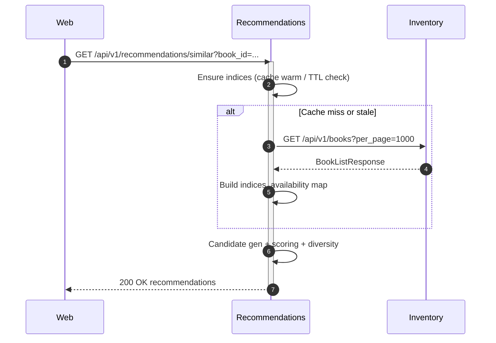

# BookVerse Recommendations Service — Plan of Action

This document outlines the goals, scope, algorithms, request/response flows, data structures, APIs, diagrams, testing strategy, and a concrete implementation TODO for the Recommendations service. It is designed to be pragmatic for the demo while leaving room for iterative enhancement.

## Goals

- Optimize for demo simplicity; showcase the build pipeline as the main focus.
- Provide relevant book recommendations with low latency and minimal dependencies.
- Start with content-based recommendations and trending fallbacks; enable future personalization.
- Keep the solution simple to operate: in-memory indices, FastAPI endpoints, and HTTP calls to `inventory`.

## Non-goals (for this iteration)

- Heavy ML or model training pipelines.
- Persistent feature stores or background jobs beyond an in-memory cache refresh.
- Full user profile service; we’ll accept optional user/context signals and degrade gracefully.
- Advanced text embedding similarity or MMR diversification (keep results simple and fast).

## Inputs and Signals

- Inventory service catalog data (`/api/v1/books`): id, title, authors, genres, price, cover, availability.
- Optional seed(s): `book_id`, `seed_book_ids[]`, `seed_genres[]`, `seed_authors[]`.
- Optional user context: `user_id` (reserved), `recently_viewed[]` (client-supplied), `cart_book_ids[]`.
- Trending proxy: Inventory transactions (`/api/v1/transactions`) focusing on `stock_out` counts.

## Outputs

- Ranked list of recommended books with essential fields (id, title, authors, genres, price, cover, availability, score breakdown).

## High-level Architecture

- Online recommendations only (no offline batch). In-memory indices are rebuilt periodically or on first request.
- Dependencies:
  - Inventory HTTP API for book catalog and transactions.
  - No direct DB access.
- Runtime:
  - FastAPI app (`app/main.py` today) extended with new routers, services, caching utilities.

## API Design

1) GET `/api/v1/recommendations/similar`
   - Query: `book_id` (UUID), `limit` (int, default 10)
   - Returns: Similar books based on genres/authors/text with popularity tie-breakers.

2) GET `/api/v1/recommendations/personalized`
   - Query: `user_id` (string, optional), `recently_viewed[]`, `cart_book_ids[]`, `seed_genres[]`, `seed_authors[]`, `limit` (default 10)
   - Returns: Ranked list based on provided context; falls back to content-based/trending.

3) GET `/api/v1/recommendations/trending`
   - Query: `limit` (default 10)
   - Returns: Books ranked by recent `stock_out` counts (approx. popularity) or catalog presence when sparse.

4) GET `/api/v1/recommendations/health`
   - Returns: Cache/index freshness, source connectivity probes.

Response shape (for all lists):

```json
{
  "recommendations": [
    {
      "id": "<uuid>",
      "title": "...",
      "authors": ["..."],
      "genres": ["..."],
      "price": 12.34,
      "cover_image_url": "...",
      "availability": {"quantity_available": 7, "in_stock": true, "low_stock": false},
      "score": 0.87,
      "score_factors": {"genre": 0.6, "author": 0.2, "text": 0.05, "popularity": 0.02}
    }
  ],
  "meta": {"limit": 10, "total_candidates": 132, "generated_at": "<iso8601>"}
}
```

## Recommendation Algorithm (Demo-simple)

### Candidate Generation

- From seed(s): union of books sharing at least one genre or author with any seed.
- From context arrays (`recently_viewed`, `cart_book_ids`): treat as seeds too.
- If seeds absent: use `seed_genres[]`/`seed_authors[]`; if also absent: take trending top-N as seeds or return trending directly.

### Scoring Function (simple rule-based)

Minimal, readable scoring. No text similarity, no MMR/diversification. Filter out-of-stock by default.

- Genre overlap count: number of shared genres with seeds.
- Author overlap count: number of shared authors with seeds (usually 0/1).
- Popularity: normalized `stock_out` count (0..1) as a small tie-breaker.

Score function:
\[ \text{score}(b) = 1.0\cdot |G_{seed} \cap G_b| + 0.25\cdot |A_{seed} \cap A_b| + 0.10\cdot \text{pop}(b) \]

### Data Structures (in-memory indices)

- `book_by_id: Dict[str, BookLite]`
- `genre_to_book_ids: Dict[str, Set[str]>`
- `author_to_book_ids: Dict[str, Set[str]>`
- `popularity_by_book_id: Dict[str, float]` (0..1 normalized)
- Optional `text_vector_by_book_id` or token sets for cheap overlap.

### Complexity

- Index build: O(N) over books; memory O(N + E) where E is edges implied by inverted indices.
- Candidate fetch per seed: O(deg(seed)) using set unions from indices.
- Scoring: O(K) for K candidates; sorting O(K log K).

### Pseudocode (core)

```python
# Preload minimal indices from inventory service
books = fetch_all_books()
book_by_id, genre_to_book_ids, author_to_book_ids = build_indices(books)
popularity = compute_popularity()  # normalized 0..1; optional

def recommend_similar(book_id, limit=10):
    seed = book_by_id.get(book_id)
    if not seed:
        return []
    candidates = set()
    for g in seed.genres:
        candidates |= genre_to_book_ids.get(g, set())
    for a in seed.authors:
        candidates |= author_to_book_ids.get(a, set())
    candidates.discard(book_id)
    scored = []
    for cid in candidates:
        b = book_by_id[cid]
        if not b.availability.in_stock:
            continue
        score = (
            1.0 * len(set(seed.genres) & set(b.genres))
            + 0.25 * len(set(seed.authors) & set(b.authors))
            + 0.10 * popularity.get(cid, 0.0)
        )
        scored.append((cid, score))
    ranked = sorted(scored, key=lambda x: x[1], reverse=True)
    return top_k_enriched(ranked, limit, book_by_id)

def personalized(ctx, limit=10):
    seeds = set(ctx.seed_book_ids) | set(ctx.recently_viewed) | set(ctx.cart_book_ids)
    if not seeds and (ctx.seed_genres or ctx.seed_authors):
        return recommend_from_features(ctx.seed_genres, ctx.seed_authors, limit)
    if not seeds:
        return trending(limit)
    agg_genres, agg_authors = derive_seed_features(seeds)
    return recommend_from_features(agg_genres, agg_authors, limit)
```

## Request Flow Diagrams

### Sequence: Similar Recommendations



### Activity: Personalized Flow

```mermaid
flowchart TD
  A[Request] --> B{Seeds provided?}
  B -- book_id(s) --> C[Fetch seed books]
  B -- features --> D[Use seed_genres/seed_authors]
  B -- none --> E[Trending]
  C --> F[Gather candidates from indices]
  D --> F
  F --> G[Score + Normalize]
  G --> H[Filter in-stock + Exclude seeds]
  H --> I[Diversify (MMR)]
  I --> J[Top-K + Enrich]
  E --> J
  J --> K[Respond]
```

## Caching and Freshness

- Optional (disabled by default for demo simplicity). If enabled, use TTL-based in-memory cache for:
  - Catalog snapshot and indices (e.g., TTL 60s for demo).
  - Popularity map (e.g., TTL 120s; cheap to recompute from first page of transactions).
- Eager warmup on first request; optional background refresh task (non-blocking).
- Configurable via environment variables.

## Build and Release (Primary Focus)

- Single standardized CI pipeline modeled after `bookverse-inventory` improvements:
  - Python setup with pip caching; style/lint (ruff or flake8), unit tests with coverage.
  - Build Docker image with BuildKit cache; tag with branch/sha/semver; push to registry.
  - Sign/attest image (cosign/SLSA provenance) if available.
  - Scan image and dependencies; publish evidence artifacts.
  - Reusable workflow template from `bookverse-demo-init/templates/python_docker/ci.yml`.
- CD via Helm/Argo CD using existing chart wiring; environment variables already plumbed.
- Keep application code minimal; pipeline quality is the star of the demo.

### Multi-artifact Delivery (intentional complexity for CI/CD showcase)

We will ship multiple artifacts per service to demonstrate advanced CI/CD handling and AppTrust application versions with rich content:

- Docker images:
  - `recommendations-api`: the FastAPI service (current container).
  - `recommendations-worker`: an optional background refresher that periodically warms indices and popularity (can be a tiny Python process running a scheduled loop).
- Config bundles:
  - `config/recommendations-settings.yaml`: weights, TTLs, feature flags. Versioned and shipped alongside images.
- Data/resources:
  - `resources/stopwords.txt` or `resources/demo-weights.json` used by the simple scorer (harmless but demonstrates non-image artifacts).
- Attestations:
  - `attestations/*.intoto.jsonl` for provenance.

CI will build, scan, and publish all of the above; the application version content will include both images and these files (e.g., uploaded to an artifacts repo and referenced by the Helm chart values or mounted via ConfigMap/Secret at deploy).

## Configuration

- `INVENTORY_BASE_URL` (required): base URL to inventory service.
- `RECO_LIMIT_DEFAULT` (int): default list size.
- `RECO_TTL_SECONDS` (int): index TTL.
- `RECO_TX_TTL_SECONDS` (int): popularity TTL.
- `RECO_WEIGHTS` (JSON or discrete env vars): WG, WA, WT, WP, WV, WD.
- `RECO_FILTER_OUT_OF_STOCK` (bool, default true).

These map to Helm values; web service already supports `RECOMMENDATIONS_BASE_URL` and Helm wiring exists.

## Error Handling and Resilience

- Inventory timeouts with fallback to last-good cache.
- If no data available, return empty list with `meta` and 200; reserve 5xx for internal errors.
- Validate inputs early; cap `limit`.

## Observability

- Structured logs for cache warm, candidate counts, latency buckets.
- Basic metrics (if added later): requests, latency, cache hit ratio.

## Testing Strategy

- Unit: similarity functions (Jaccard, text overlap), scoring, MMR diversification.
- Unit: cache TTL and rebuild behavior (inject clock or TTL overrides).
- API: endpoint contracts and error codes; golden responses with seeded data.
- Manual E2E: launch inventory + recommendations, verify non-empty results for seeds.

## Phased Delivery

1) Establish CI/CD pipeline parity with `inventory` (build, test, scan, sign, push).
2) Add multi-artifact pipeline stages (build `api` and `worker` images; package `config/` and `resources/`; generate attestations for each).
3) Skeleton endpoints and contracts returning simple lists with schemas.
4) Integrate inventory books, build minimal indices, implement `/similar` with rule-based scoring.
5) Add `/personalized` using context seeds and same simple scoring.
6) Add `/trending` using `stock_out` counts as popularity.
7) Optional: lightweight TTL cache and health endpoint with freshness info.

## Implementation TODO (prioritized)

- [ ] Establish CI pipeline using shared template; enable scanning, signing/attestation, evidence.
- [ ] Update CI/CD workflows across all services based on inventory service lessons; sync templates in `bookverse-demo-init`.
- [ ] Introduce multi-artifact build: `recommendations-api` and `recommendations-worker` images; package `config/` and `resources/`.
- [ ] Add `app/api.py` router with `/similar`, `/personalized`, `/trending`, `/health`.
- [ ] Add `app/clients/inventory_client.py` to fetch books and transactions.
- [ ] Add `app/services/indexer.py` for minimal in-memory indices (genre/author/popularity).
- [ ] Add `app/services/algorithms.py` with simple rule-based scoring only.
- [ ] Wire endpoints in `app/main.py` to router and startup hooks.
- [ ] Implement simple `/api/v1/recommendations/similar`.
- [ ] Implement simple `/api/v1/recommendations/personalized` and `/trending`.
- [ ] Add minimal configuration defaults (env + settings module).
- [ ] Add unit tests for scoring and endpoint contracts.
- [ ] Optional: health endpoint to report cache state and index freshness.
- [ ] Document usage in `README.md` with deployment notes and UI-only interaction (no curl needed).

## Acceptance Criteria (expanded for CI/CD demo)

- Two Docker images produced per service: `recommendations-api` and `recommendations-worker`.
- Non-image artifacts published per release: `config/` bundle, `resources/` assets, and attestations.
- Application version content includes references to both images and additional files.
- Helm values and/or ConfigMaps updated to mount or reference the published config/resources.
- Pipeline publishes evidence (scan reports and signatures/attestations) and passes quality gates.

## Acceptance Criteria

- Similar endpoint returns non-empty list for any book that shares at least one genre/author with others.
- Personalized endpoint returns relevant items given `recently_viewed` or `seed_genres`.
- Trending endpoint returns stable results without inventory dependency outages.
- P95 latency under ~100ms with warm cache in demo dataset.
- Configurable weights and TTLs via environment variables.

## Future Enhancements

- Implicit feedback loops from clickthroughs and purchases.
- Embedding-based text similarity (e.g., MiniLM) behind a feature flag.
- Batch precomputation for large catalogs and LRU caching per endpoint.
