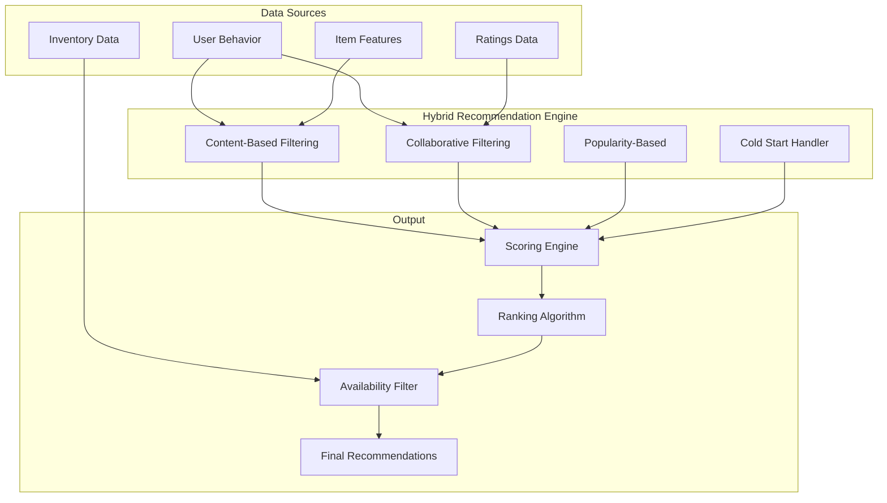

# Recommendations Service - Algorithm Guide

**Engine explanation, configuration parameters, and performance tuning for the BookVerse recommendation system**

This guide provides comprehensive documentation for the recommendation algorithms, their configuration, and optimization strategies for developers and data scientists working with the BookVerse recommendation engine.

---

## 🤖 Algorithm Overview

The BookVerse Recommendations Service implements a hybrid recommendation system combining multiple algorithmic approaches to deliver personalized book suggestions with sub-200ms response times.

### 🎯 **Recommendation Strategies**



---

## 📚 Core Algorithms

### 🔍 **Content-Based Filtering**

Content-based filtering recommends books based on item features and user preferences, making it effective for new users and items.

**Algorithm Implementation:**
```python
def content_based_score(user_profile, item_features, weights):
    """
    Calculate content-based similarity score.
    
    Args:
        user_profile: User preference vector
        item_features: Item feature vector (genres, authors, keywords)
        weights: Feature importance weights
    
    Returns:
        Similarity score (0.0 to 1.0)
    """
    # Genre similarity with TF-IDF weighting
    genre_score = cosine_similarity(
        user_profile['genres'], 
        item_features['genres']
    ) * weights['genre']
    
    # Author similarity
    author_score = jaccard_similarity(
        user_profile['authors'],
        item_features['authors']
    ) * weights['author']
    
    # Keyword similarity using word embeddings
    keyword_score = semantic_similarity(
        user_profile['keywords'],
        item_features['keywords']
    ) * weights['keywords']
    
    return (genre_score + author_score + keyword_score) / 3
```

**Feature Extraction:**
- **Genre Vectors**: Multi-hot encoding with TF-IDF weighting
- **Author Similarity**: Jaccard coefficient for author overlap
- **Keyword Matching**: Word2Vec embeddings for semantic similarity
- **Rating Patterns**: Historical rating distribution preferences

**Configuration Parameters:**
```yaml
content_based:
  genre_weight: 0.4
  author_weight: 0.3
  keyword_weight: 0.2
  rating_pattern_weight: 0.1
  similarity_threshold: 0.3
  max_recommendations: 50
```

### 👥 **Collaborative Filtering**

Collaborative filtering leverages user behavior patterns to find similar users and recommend books they enjoyed.

**User-Based Collaborative Filtering:**
```python
def user_collaborative_score(target_user, item_id, user_similarities):
    """
    Calculate user-based collaborative filtering score.
    
    Args:
        target_user: Target user ID
        item_id: Item to score
        user_similarities: Precomputed user similarity matrix
    
    Returns:
        Predicted rating score
    """
    similar_users = user_similarities[target_user].top_k(50)
    weighted_sum = 0
    similarity_sum = 0
    
    for user, similarity in similar_users:
        if item_id in user_ratings[user]:
            rating = user_ratings[user][item_id]
            weighted_sum += similarity * rating
            similarity_sum += abs(similarity)
    
    if similarity_sum == 0:
        return 0
    
    return weighted_sum / similarity_sum
```

**Item-Based Collaborative Filtering:**
```python
def item_collaborative_score(user_id, target_item, item_similarities):
    """
    Calculate item-based collaborative filtering score.
    
    Args:
        user_id: User for whom to generate recommendation
        target_item: Item to score
        item_similarities: Precomputed item similarity matrix
    
    Returns:
        Predicted preference score
    """
    user_items = get_user_rated_items(user_id)
    similar_items = item_similarities[target_item].top_k(30)
    
    weighted_sum = 0
    similarity_sum = 0
    
    for item, similarity in similar_items:
        if item in user_items:
            rating = user_items[item]
            weighted_sum += similarity * rating
            similarity_sum += abs(similarity)
    
    return weighted_sum / similarity_sum if similarity_sum > 0 else 0
```

**Configuration Parameters:**
```yaml
collaborative_filtering:
  user_based:
    enabled: true
    similarity_metric: "cosine"  # cosine, pearson, jaccard
    min_common_items: 5
    neighbor_count: 50
    weight: 0.6
  
  item_based:
    enabled: true
    similarity_metric: "cosine"
    min_common_users: 10
    neighbor_count: 30
    weight: 0.4
```

### 📊 **Popularity-Based Recommendations**

Popularity-based algorithms ensure trending and well-regarded books are surfaced, particularly useful for cold start scenarios.

**Trending Score Calculation:**
```python
def calculate_trending_score(item_id, time_window_days=7):
    """
    Calculate trending score based on recent activity.
    
    Args:
        item_id: Book ID to score
        time_window_days: Recent activity window
    
    Returns:
        Trending score (0.0 to 1.0)
    """
    recent_views = get_recent_views(item_id, time_window_days)
    recent_purchases = get_recent_purchases(item_id, time_window_days)
    recent_ratings = get_recent_ratings(item_id, time_window_days)
    
    # Weighted trending score
    trending_score = (
        recent_views * 0.3 +
        recent_purchases * 0.5 +
        recent_ratings * 0.2
    )
    
    # Apply decay function for recency
    decay_factor = calculate_time_decay(time_window_days)
    return trending_score * decay_factor
```

**Quality Score Implementation:**
```python
def calculate_quality_score(item_id):
    """
    Calculate overall quality score for a book.
    
    Returns:
        Quality score (0.0 to 1.0)
    """
    ratings = get_item_ratings(item_id)
    
    if len(ratings) < 5:  # Insufficient data
        return 0.5  # Neutral score
    
    # Bayesian average to handle rating bias
    global_avg_rating = get_global_average_rating()
    confidence_factor = min(len(ratings) / 100, 1.0)
    
    bayesian_avg = (
        (confidence_factor * np.mean(ratings)) +
        ((1 - confidence_factor) * global_avg_rating)
    )
    
    # Normalize to 0-1 scale
    return (bayesian_avg - 1) / 4  # Assuming 1-5 rating scale
```

**Configuration Parameters:**
```yaml
popularity_based:
  trending:
    time_window_days: 7
    view_weight: 0.3
    purchase_weight: 0.5
    rating_weight: 0.2
    decay_rate: 0.1
  
  quality:
    min_ratings_threshold: 5
    confidence_factor_max: 100
    global_fallback_enabled: true
    bayesian_smoothing: true
```

---

## ⚙️ Algorithm Configuration

### 🎛️ **Scoring Weights**

The final recommendation score combines multiple algorithms using configurable weights:

```python
def calculate_final_score(user_id, item_id, algorithms_config):
    """
    Calculate final recommendation score using weighted combination.
    
    Args:
        user_id: Target user
        item_id: Item to score
        algorithms_config: Algorithm configuration
    
    Returns:
        Final recommendation score (0.0 to 1.0)
    """
    scores = {}
    
    # Content-based score
    if algorithms_config['content_based']['enabled']:
        scores['content'] = content_based_score(user_id, item_id)
    
    # Collaborative filtering score
    if algorithms_config['collaborative']['enabled']:
        scores['collaborative'] = collaborative_score(user_id, item_id)
    
    # Popularity score
    if algorithms_config['popularity']['enabled']:
        scores['popularity'] = popularity_score(item_id)
    
    # Cold start handling
    if is_cold_start_user(user_id):
        scores = apply_cold_start_boost(scores, algorithms_config)
    
    # Weighted combination
    final_score = 0
    total_weight = 0
    
    for algorithm, score in scores.items():
        weight = algorithms_config[algorithm]['weight']
        final_score += score * weight
        total_weight += weight
    
    return final_score / total_weight if total_weight > 0 else 0
```

### 📐 **Configuration Schema**

**Complete Algorithm Configuration:**
```yaml
# algorithms.yaml
recommendation_engine:
  # Global settings
  max_recommendations: 20
  min_score_threshold: 0.3
  diversity_factor: 0.2
  freshness_factor: 0.1
  
  # Algorithm weights (must sum to 1.0)
  algorithm_weights:
    content_based: 0.35
    collaborative: 0.45
    popularity: 0.20
  
  # Content-based configuration
  content_based:
    enabled: true
    genre_weight: 0.4
    author_weight: 0.3
    keyword_weight: 0.2
    rating_pattern_weight: 0.1
    similarity_threshold: 0.3
    use_semantic_similarity: true
    word_embedding_model: "word2vec"
  
  # Collaborative filtering configuration
  collaborative:
    enabled: true
    user_based_weight: 0.6
    item_based_weight: 0.4
    min_common_items: 5
    neighbor_count: 50
    similarity_metric: "cosine"
    apply_user_bias_correction: true
  
  # Popularity-based configuration
  popularity:
    enabled: true
    trending_weight: 0.6
    quality_weight: 0.4
    time_window_days: 7
    min_interactions_threshold: 10
    apply_recency_decay: true
  
  # Cold start handling
  cold_start:
    user_threshold_interactions: 5
    item_threshold_interactions: 10
    fallback_to_popularity: true
    boost_factor: 1.5
    onboarding_recommendations: 10
  
  # Filtering and post-processing
  filters:
    availability_filter: true
    diversity_promotion: true
    avoid_recently_purchased: true
    avoid_recently_viewed_days: 1
    max_same_author: 3
    max_same_genre: 5
```

---

## 🚀 Performance Optimization

### ⚡ **Caching Strategies**

**Multi-Level Caching Architecture:**
```python
class RecommendationCache:
    """
    Multi-level caching for recommendation components.
    """
    
    def __init__(self):
        self.l1_cache = {}  # In-memory cache
        self.l2_cache = Redis()  # Redis cache
        self.l3_cache = Database()  # Persistent cache
    
    def get_user_recommendations(self, user_id, cache_ttl=300):
        """Get cached recommendations with fallback hierarchy."""
        
        # L1 Cache (in-memory)
        cache_key = f"recs:{user_id}"
        if cache_key in self.l1_cache:
            return self.l1_cache[cache_key]
        
        # L2 Cache (Redis)
        cached_recs = self.l2_cache.get(cache_key)
        if cached_recs:
            self.l1_cache[cache_key] = cached_recs
            return cached_recs
        
        # L3 Cache (Database)
        db_recs = self.l3_cache.get_cached_recommendations(user_id)
        if db_recs and not self._is_stale(db_recs, cache_ttl):
            self.l2_cache.setex(cache_key, cache_ttl, db_recs)
            self.l1_cache[cache_key] = db_recs
            return db_recs
        
        # Generate new recommendations
        fresh_recs = self._generate_recommendations(user_id)
        self._update_all_caches(cache_key, fresh_recs, cache_ttl)
        return fresh_recs
```

**Precomputation Strategy:**
```python
def precompute_similarities():
    """
    Precompute similarity matrices for performance.
    Run as background job every 6 hours.
    """
    # User similarity matrix
    user_similarity_matrix = compute_user_similarities()
    store_similarity_matrix("user_similarities", user_similarity_matrix)
    
    # Item similarity matrix
    item_similarity_matrix = compute_item_similarities()
    store_similarity_matrix("item_similarities", item_similarity_matrix)
    
    # Popular items cache
    trending_items = compute_trending_items()
    cache_trending_items(trending_items, ttl=3600)
    
    # Quality scores cache
    quality_scores = compute_quality_scores()
    cache_quality_scores(quality_scores, ttl=21600)  # 6 hours
```

### 📊 **Performance Monitoring**

**Algorithm Performance Metrics:**
```python
class AlgorithmMetrics:
    """Track algorithm performance and quality metrics."""
    
    def __init__(self):
        self.metrics = {
            'response_time': [],
            'cache_hit_rate': 0,
            'recommendation_accuracy': 0,
            'diversity_score': 0,
            'coverage_score': 0
        }
    
    def track_recommendation_request(self, user_id, response_time, cache_hit):
        """Track individual recommendation request metrics."""
        self.metrics['response_time'].append(response_time)
        
        if cache_hit:
            self.metrics['cache_hit_rate'] += 1
        
        # Log for analysis
        logger.info(f"Recommendation request: user={user_id}, "
                   f"time={response_time}ms, cache_hit={cache_hit}")
    
    def calculate_recommendation_quality(self, user_id, recommendations):
        """Calculate recommendation quality metrics."""
        
        # Diversity: How different are the recommendations?
        diversity = calculate_intra_list_diversity(recommendations)
        
        # Coverage: What percentage of catalog is being recommended?
        coverage = len(set(recommendations)) / total_catalog_size
        
        # Novelty: How many new/unknown items are recommended?
        user_history = get_user_interaction_history(user_id)
        novelty = len([r for r in recommendations if r not in user_history])
        
        return {
            'diversity': diversity,
            'coverage': coverage, 
            'novelty': novelty / len(recommendations)
        }
```

---

## 🧪 A/B Testing Framework

### 🔬 **Algorithm Experimentation**

**A/B Test Configuration:**
```python
class RecommendationExperiment:
    """
    A/B testing framework for recommendation algorithms.
    """
    
    def __init__(self):
        self.experiments = self._load_experiments()
    
    def get_algorithm_variant(self, user_id):
        """
        Determine which algorithm variant to use for a user.
        
        Returns:
            Algorithm configuration for the assigned variant
        """
        user_hash = hash(user_id) % 100
        
        for experiment in self.experiments:
            if experiment['active']:
                for variant in experiment['variants']:
                    if (user_hash >= variant['traffic_start'] and 
                        user_hash < variant['traffic_end']):
                        return variant['algorithm_config']
        
        return self.get_default_config()
    
    def track_experiment_metrics(self, user_id, variant, recommendations, 
                                interactions):
        """Track metrics for experiment analysis."""
        
        metrics = {
            'user_id': user_id,
            'variant': variant,
            'timestamp': datetime.utcnow(),
            'recommendations': recommendations,
            'click_through_rate': calculate_ctr(recommendations, interactions),
            'conversion_rate': calculate_conversion(recommendations, interactions),
            'engagement_score': calculate_engagement(interactions)
        }
        
        # Store for analysis
        store_experiment_metrics(metrics)
```

**Experiment Configuration:**
```yaml
# experiments.yaml
experiments:
  - name: "algorithm_weight_test"
    active: true
    start_date: "2024-01-01"
    end_date: "2024-02-01"
    variants:
      - name: "control"
        traffic_percentage: 50
        traffic_start: 0
        traffic_end: 50
        algorithm_config:
          algorithm_weights:
            content_based: 0.35
            collaborative: 0.45
            popularity: 0.20
      
      - name: "treatment"
        traffic_percentage: 50
        traffic_start: 50
        traffic_end: 100
        algorithm_config:
          algorithm_weights:
            content_based: 0.30
            collaborative: 0.50
            popularity: 0.20
```

---

## 📈 Algorithm Tuning

### 🎯 **Hyperparameter Optimization**

**Grid Search Implementation:**
```python
def optimize_algorithm_parameters():
    """
    Optimize recommendation algorithm parameters using grid search.
    """
    
    # Define parameter grid
    param_grid = {
        'content_based_weight': [0.2, 0.3, 0.4, 0.5],
        'collaborative_weight': [0.3, 0.4, 0.5, 0.6],
        'popularity_weight': [0.1, 0.15, 0.2, 0.25],
        'similarity_threshold': [0.2, 0.3, 0.4],
        'neighbor_count': [30, 50, 70, 100]
    }
    
    best_params = None
    best_score = 0
    
    # Validation dataset
    validation_users = get_validation_users(sample_size=1000)
    
    for params in ParameterGrid(param_grid):
        # Ensure weights sum to 1.0
        if (params['content_based_weight'] + 
            params['collaborative_weight'] + 
            params['popularity_weight']) != 1.0:
            continue
        
        # Test parameter combination
        score = evaluate_parameters(params, validation_users)
        
        if score > best_score:
            best_score = score
            best_params = params
    
    return best_params, best_score

def evaluate_parameters(params, validation_users):
    """
    Evaluate parameter combination using validation metrics.
    
    Returns:
        Combined evaluation score
    """
    precision_scores = []
    recall_scores = []
    diversity_scores = []
    
    for user_id in validation_users:
        # Generate recommendations with parameters
        recommendations = generate_recommendations(user_id, params)
        
        # Get ground truth (actual interactions)
        ground_truth = get_user_ground_truth(user_id)
        
        # Calculate metrics
        precision = calculate_precision_at_k(recommendations, ground_truth, k=10)
        recall = calculate_recall_at_k(recommendations, ground_truth, k=10)
        diversity = calculate_diversity(recommendations)
        
        precision_scores.append(precision)
        recall_scores.append(recall)
        diversity_scores.append(diversity)
    
    # Combined score (weighted average)
    combined_score = (
        0.4 * np.mean(precision_scores) +
        0.4 * np.mean(recall_scores) +
        0.2 * np.mean(diversity_scores)
    )
    
    return combined_score
```

### 📊 **Real-time Performance Adaptation**

**Dynamic Parameter Adjustment:**
```python
class AdaptiveRecommendationEngine:
    """
    Recommendation engine that adapts parameters based on real-time performance.
    """
    
    def __init__(self):
        self.performance_window = 1000  # Track last 1000 requests
        self.performance_history = []
        self.current_params = load_default_params()
    
    def adapt_parameters(self):
        """
        Adjust parameters based on recent performance metrics.
        """
        if len(self.performance_history) < self.performance_window:
            return
        
        recent_performance = self.performance_history[-self.performance_window:]
        
        # Calculate recent metrics
        avg_response_time = np.mean([p['response_time'] for p in recent_performance])
        avg_ctr = np.mean([p['click_through_rate'] for p in recent_performance])
        
        # Adapt based on performance
        if avg_response_time > 200:  # Too slow
            self._reduce_computation_complexity()
        
        if avg_ctr < 0.05:  # Low engagement
            self._increase_personalization()
        
        # Log parameter changes
        logger.info(f"Parameters adapted: response_time={avg_response_time}ms, "
                   f"ctr={avg_ctr}, new_params={self.current_params}")
    
    def _reduce_computation_complexity(self):
        """Reduce computational complexity for faster responses."""
        self.current_params['neighbor_count'] = max(30, 
            int(self.current_params['neighbor_count'] * 0.8))
        self.current_params['similarity_threshold'] = min(0.5,
            self.current_params['similarity_threshold'] + 0.05)
    
    def _increase_personalization(self):
        """Increase personalization to improve engagement."""
        self.current_params['algorithm_weights']['collaborative'] = min(0.6,
            self.current_params['algorithm_weights']['collaborative'] + 0.05)
        self.current_params['algorithm_weights']['popularity'] = max(0.1,
            self.current_params['algorithm_weights']['popularity'] - 0.05)
```

---

## 🔍 Algorithm Evaluation

### 📊 **Evaluation Metrics**

**Offline Evaluation Framework:**
```python
class RecommendationEvaluator:
    """
    Comprehensive evaluation framework for recommendation algorithms.
    """
    
    def evaluate_algorithm(self, algorithm, test_data):
        """
        Evaluate algorithm performance on test dataset.
        
        Returns:
            Dictionary of evaluation metrics
        """
        results = {
            'accuracy_metrics': {},
            'ranking_metrics': {},
            'diversity_metrics': {},
            'coverage_metrics': {},
            'novelty_metrics': {}
        }
        
        for user_id, ground_truth in test_data.items():
            recommendations = algorithm.get_recommendations(user_id, k=20)
            
            # Accuracy metrics
            results['accuracy_metrics'][user_id] = {
                'precision_at_5': precision_at_k(recommendations, ground_truth, 5),
                'precision_at_10': precision_at_k(recommendations, ground_truth, 10),
                'recall_at_5': recall_at_k(recommendations, ground_truth, 5),
                'recall_at_10': recall_at_k(recommendations, ground_truth, 10),
                'f1_score': f1_score(recommendations, ground_truth)
            }
            
            # Ranking metrics
            results['ranking_metrics'][user_id] = {
                'ndcg_at_5': ndcg_at_k(recommendations, ground_truth, 5),
                'ndcg_at_10': ndcg_at_k(recommendations, ground_truth, 10),
                'map_score': mean_average_precision(recommendations, ground_truth)
            }
            
            # Diversity metrics
            results['diversity_metrics'][user_id] = {
                'intra_list_diversity': intra_list_diversity(recommendations),
                'genre_diversity': genre_diversity(recommendations),
                'author_diversity': author_diversity(recommendations)
            }
        
        # Aggregate results
        return self._aggregate_metrics(results)
```

**Online Evaluation (A/B Testing):**
```python
def online_evaluation_metrics(variant_a_data, variant_b_data):
    """
    Compare two algorithm variants using online metrics.
    
    Returns:
        Statistical significance test results
    """
    
    metrics = {}
    
    # Click-through rate comparison
    ctr_a = calculate_ctr(variant_a_data)
    ctr_b = calculate_ctr(variant_b_data)
    metrics['ctr_lift'] = (ctr_b - ctr_a) / ctr_a * 100
    metrics['ctr_significance'] = t_test(
        [u['ctr'] for u in variant_a_data],
        [u['ctr'] for u in variant_b_data]
    )
    
    # Conversion rate comparison
    conv_a = calculate_conversion_rate(variant_a_data)
    conv_b = calculate_conversion_rate(variant_b_data)
    metrics['conversion_lift'] = (conv_b - conv_a) / conv_a * 100
    metrics['conversion_significance'] = t_test(
        [u['conversions'] for u in variant_a_data],
        [u['conversions'] for u in variant_b_data]
    )
    
    # Engagement metrics
    engagement_a = calculate_engagement(variant_a_data)
    engagement_b = calculate_engagement(variant_b_data)
    metrics['engagement_lift'] = (engagement_b - engagement_a) / engagement_a * 100
    
    return metrics
```

---

## 📞 Algorithm Support

### 🤝 **Getting Help**
- **📖 [Service Overview](../SERVICE_OVERVIEW.md)** - Business context and architecture
- **🏗️ [Architecture Guide](ARCHITECTURE.md)** - System design and data pipeline
- **🤖 [ML Guide](MACHINE_LEARNING.md)** - Model details and feature engineering
- **⚙️ [Operations Guide](OPERATIONS.md)** - Monitoring and troubleshooting

### 🔧 **Algorithm Resources**
- **📊 [Performance Tuning](../performance/)** - Optimization strategies
- **🧪 [A/B Testing](../experiments/)** - Experimentation framework
- **📈 [Metrics Dashboard](../monitoring/)** - Real-time algorithm performance
- **💬 [Algorithm Discussions](../../discussions)** - Community support

---

*This algorithm guide is continuously updated based on performance analysis and research developments. For questions about algorithm implementation or optimization, please engage with our [ML engineering community](../../discussions).*
