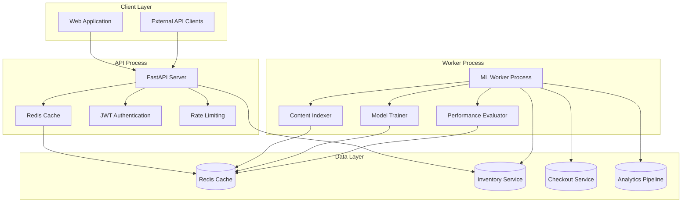
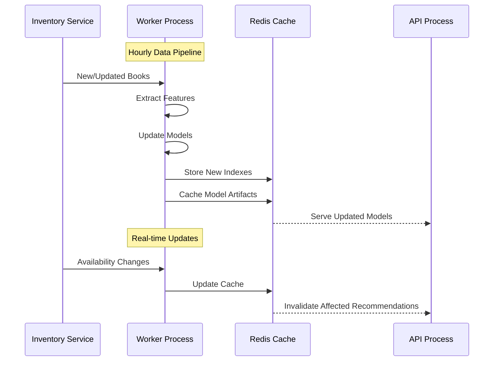
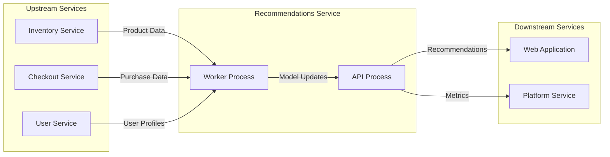

# BookVerse Recommendations Service - Architecture Guide

**AI-Powered Recommendation Engine with API/Worker Separation**

This document provides a comprehensive architectural overview of the BookVerse Recommendations Service, focusing on the dual-process design that separates real-time API operations from intensive machine learning computations.

---

## 🏗️ Architecture Overview

The Recommendations Service implements a sophisticated **API/Worker Architecture** that optimizes for both real-time response requirements and computational efficiency:



---

## 🚀 API Process Architecture

### Core Components

#### **FastAPI Application Server**
- **Purpose**: Handle real-time recommendation requests with sub-200ms response times
- **Responsibilities**:
  - Serve recommendation endpoints for web and API clients
  - Implement JWT authentication and authorization
  - Provide rate limiting and request throttling
  - Cache recommendation results for performance optimization
  - Monitor API performance and health metrics

#### **Cache Management Layer**
- **Technology**: Redis with intelligent cache strategies
- **Cache Hierarchies**:
  - **L1 Cache**: Application-level caching for frequently accessed data
  - **L2 Cache**: Redis-based caching for recommendation results
  - **L3 Cache**: Model artifact caching for algorithm performance
- **Cache Strategies**:
  - **Recommendation Results**: TTL-based expiration (5-15 minutes)
  - **User Profiles**: Session-based caching with automatic invalidation
  - **Model Artifacts**: Version-based caching with manual invalidation

#### **Authentication & Security**
- **JWT Token Validation**: Integration with BookVerse Core authentication
- **Rate Limiting**: Per-user and per-IP rate limiting to prevent abuse
- **Request Validation**: Pydantic-based input validation and sanitization
- **CORS Handling**: Cross-origin request management for web applications

### Performance Characteristics

| Metric | Target | Typical |
|--------|--------|---------|
| Response Time | < 200ms | 50-150ms |
| Throughput | 1000+ RPS | 1500 RPS |
| Cache Hit Rate | > 85% | 90-95% |
| Availability | 99.9% | 99.95% |

---

## 🤖 Worker Process Architecture

### Machine Learning Pipeline

#### **Content Indexer**
- **Purpose**: Build and maintain searchable indexes for content-based filtering
- **Processes**:
  - **Metadata Extraction**: Extract features from book titles, descriptions, genres
  - **Vector Embedding**: Generate embeddings for semantic similarity
  - **Index Construction**: Build optimized search indexes for fast retrieval
  - **Incremental Updates**: Handle real-time updates from inventory changes

#### **Model Trainer**
- **Purpose**: Train and update recommendation models using historical data
- **Algorithms**:
  - **Collaborative Filtering**: User-based and item-based recommendation models
  - **Content-Based Filtering**: Genre, author, and metadata similarity models
  - **Hybrid Models**: Combined approaches for improved accuracy
  - **Deep Learning**: Neural collaborative filtering for advanced patterns

#### **Performance Evaluator**
- **Purpose**: Continuously evaluate and optimize recommendation quality
- **Metrics**:
  - **Accuracy**: Precision, recall, and F1-score for recommendation quality
  - **Diversity**: Intra-list diversity and coverage metrics
  - **Novelty**: Recommendation freshness and discovery potential
  - **Business Metrics**: Click-through rates and conversion tracking

### Data Processing Workflows



---

## 🔄 Scaling Strategies

### Horizontal Scaling

#### **API Process Scaling**
- **Stateless Design**: All session data stored in Redis for horizontal scaling
- **Load Balancing**: Round-robin distribution across multiple API instances
- **Auto-scaling**: Kubernetes HPA based on CPU, memory, and request metrics
- **Geographic Distribution**: Multi-region deployment for global performance

#### **Worker Process Scaling**
- **Queue-Based Processing**: Task distribution using Redis queues
- **Specialized Workers**: Dedicated workers for indexing, training, and evaluation
- **Resource Allocation**: CPU-intensive workers on compute-optimized instances
- **Batch Processing**: Efficient batch operations for large-scale model updates

### Performance Optimization

#### **Caching Strategies**
```python
# Multi-level cache architecture
@cache_recommendations(ttl=300)  # L2: Redis cache
@cache_locally(max_size=1000)    # L1: Application cache
async def get_recommendations(user_id: str, book_ids: List[str]):
    # Cache miss: Generate recommendations
    return await generate_recommendations(user_id, book_ids)
```

#### **Model Optimization**
- **Model Quantization**: Reduce model size for faster inference
- **Approximate Algorithms**: Trade accuracy for speed in specific scenarios
- **Precomputed Recommendations**: Pre-generate recommendations for popular items
- **Feature Selection**: Optimize feature sets for model performance

---

## 📊 Data Pipeline Architecture

### Data Flow Management

#### **Real-time Data Ingestion**
- **Event Streaming**: Process inventory updates and user interactions in real-time
- **Change Detection**: Identify and propagate relevant changes to recommendation models
- **Data Validation**: Ensure data quality and consistency across the pipeline
- **Error Handling**: Robust error recovery and data consistency mechanisms

#### **Batch Data Processing**
- **Daily Aggregation**: Process daily user behavior and inventory changes
- **Model Retraining**: Schedule model updates based on data freshness
- **Performance Monitoring**: Track model performance degradation over time
- **A/B Testing**: Compare model versions and recommendation strategies

### Integration Patterns

#### **Service Integration**


#### **Data Synchronization**
- **Event-Driven Updates**: Real-time synchronization using event streaming
- **Eventual Consistency**: Accept temporary inconsistencies for performance
- **Conflict Resolution**: Handle concurrent updates with versioning strategies
- **Circuit Breakers**: Protect against cascading failures in data dependencies

---

## 🔧 Configuration Management

### Environment-Specific Configuration

#### **Development Environment**
```yaml
# config/development.yaml
api:
  cache_ttl: 60  # Short TTL for development
  rate_limit: 1000
  debug_mode: true

worker:
  batch_size: 100
  training_interval: "0 */4 * * *"  # Every 4 hours
  evaluation_interval: "0 */8 * * *"  # Every 8 hours

algorithms:
  default_weights:
    content_based: 0.4
    collaborative: 0.4
    popularity: 0.2
```

#### **Production Environment**
```yaml
# config/production.yaml
api:
  cache_ttl: 900  # 15 minutes
  rate_limit: 10000
  debug_mode: false

worker:
  batch_size: 1000
  training_interval: "0 2 * * *"    # Daily at 2 AM
  evaluation_interval: "0 6 * * 0"  # Weekly on Sunday

algorithms:
  default_weights:
    content_based: 0.3
    collaborative: 0.5
    popularity: 0.2
```

### Algorithm Configuration

#### **Recommendation Weights**
- **Content-Based**: Weight for genre, author, and metadata similarity
- **Collaborative Filtering**: Weight for user behavior patterns
- **Popularity**: Weight for trending and highly-rated items
- **Diversity**: Controls for recommendation diversity and novelty

#### **Performance Tuning**
- **Cache Sizes**: Memory allocation for different cache levels
- **Batch Sizes**: Optimization for batch processing operations
- **Timeout Settings**: Request timeout and retry configurations
- **Resource Limits**: CPU and memory constraints for worker processes

---

## 🛡️ Security Architecture

### Authentication & Authorization

#### **API Security**
- **JWT Validation**: Token-based authentication for all API requests
- **Scope-Based Authorization**: Fine-grained access control for different operations
- **Rate Limiting**: Protection against abuse and DDoS attacks
- **Input Validation**: Comprehensive input sanitization and validation

#### **Data Protection**
- **User Privacy**: Anonymization of sensitive user data in recommendations
- **Data Encryption**: Encryption at rest and in transit for sensitive information
- **Access Logging**: Comprehensive audit trails for all data access
- **Compliance**: GDPR and privacy regulation compliance measures

### Infrastructure Security

#### **Network Security**
- **Service Mesh**: Encrypted communication between microservices
- **Network Policies**: Kubernetes network policies for traffic isolation
- **TLS Termination**: End-to-end encryption for external communications
- **Firewall Rules**: Restrictive network access controls

#### **Container Security**
- **Image Scanning**: Vulnerability scanning for container images
- **Minimal Images**: Distroless containers for reduced attack surface
- **Security Contexts**: Non-root execution and capability restrictions
- **Secret Management**: Secure handling of credentials and API keys

---

## 📈 Monitoring & Observability

### Performance Metrics

#### **API Metrics**
- **Response Times**: P50, P95, P99 latency tracking
- **Throughput**: Requests per second and concurrent connections
- **Error Rates**: 4xx and 5xx error percentages
- **Cache Performance**: Hit rates and miss patterns

#### **ML Metrics**
- **Model Accuracy**: Precision, recall, and F1-score tracking
- **Recommendation Quality**: Diversity, novelty, and coverage metrics
- **Training Performance**: Model training time and resource usage
- **Business Impact**: Click-through rates and conversion metrics

### Health Monitoring

#### **Service Health**
- **Readiness Probes**: Service readiness for handling requests
- **Liveness Probes**: Service health and automatic restart triggers
- **Dependency Checks**: Upstream and downstream service availability
- **Resource Monitoring**: CPU, memory, and storage usage tracking

#### **Alerting Strategies**
- **Critical Alerts**: Service downtime and critical error conditions
- **Warning Alerts**: Performance degradation and resource constraints
- **Informational Alerts**: Deployment and configuration changes
- **Escalation Policies**: Automated escalation and notification workflows

---

## 🚀 Deployment Architecture

### Container Strategy

#### **Multi-Process Containers**
```dockerfile
# Separate containers for API and Worker processes
FROM python:3.11-slim as api
COPY api/ /app/
EXPOSE 8001
CMD ["uvicorn", "app.main:app", "--host", "0.0.0.0", "--port", "8001"]

FROM python:3.11-slim as worker
COPY worker/ /app/
CMD ["python", "-m", "app.worker"]
```

#### **Resource Allocation**
```yaml
# Kubernetes resource specifications
api:
  resources:
    requests:
      cpu: "500m"
      memory: "1Gi"
    limits:
      cpu: "2"
      memory: "4Gi"

worker:
  resources:
    requests:
      cpu: "1"
      memory: "2Gi"
    limits:
      cpu: "4"
      memory: "8Gi"
```

### Orchestration

#### **Kubernetes Deployment**
- **Rolling Updates**: Zero-downtime deployments with health checks
- **Resource Management**: CPU and memory limits for optimal performance
- **Service Discovery**: Kubernetes services for internal communication
- **Config Management**: ConfigMaps and Secrets for configuration

#### **Scaling Policies**
```yaml
# Horizontal Pod Autoscaler configuration
apiVersion: autoscaling/v2
kind: HorizontalPodAutoscaler
metadata:
  name: recommendations-api-hpa
spec:
  scaleTargetRef:
    apiVersion: apps/v1
    kind: Deployment
    name: recommendations-api
  minReplicas: 2
  maxReplicas: 10
  metrics:
  - type: Resource
    resource:
      name: cpu
      target:
        type: Utilization
        averageUtilization: 70
  - type: Resource
    resource:
      name: memory
      target:
        type: Utilization
        averageUtilization: 80
```

---

## 🔗 Related Documentation

- **[Algorithm Guide](ALGORITHM_GUIDE.md)**: Detailed explanation of recommendation algorithms
- **[Machine Learning Guide](MACHINE_LEARNING.md)**: ML model implementation and training
- **[Operations Guide](OPERATIONS.md)**: Monitoring, troubleshooting, and maintenance
- **[API Reference](../api/README.md)**: Complete API documentation and examples
- **[Development Guide](DEVELOPMENT_GUIDE.md)**: Local development and testing setup

---

**Authors**: BookVerse Platform Team  
**Version**: 1.0.0  
**Last Updated**: 2024-01-01
