# 🏗️ BookVerse Recommendations Service - CI/CD Architecture

## 📋 Table of Contents

- [Overview](#overview)
- [Architecture Diagram](#architecture-diagram)
- [Workflow Components](#workflow-components)
- [Artifact Management](#artifact-management)
- [Security & Compliance](#security--compliance)
- [Integration Points](#integration-points)
- [Deployment Strategy](#deployment-strategy)
- [Monitoring & Observability](#monitoring--observability)
- [Troubleshooting Guide](#troubleshooting-guide)

## 🎯 Overview

The BookVerse Recommendations Service implements a comprehensive, enterprise-grade CI/CD pipeline that demonstrates modern software delivery practices with a focus on security, compliance, and observability. This document provides a detailed architectural overview of the CI/CD system.

### Key Objectives

- **🚀 Automated Delivery**: Complete automation from code commit to production deployment
- **🔒 Security First**: Zero-trust security model with OIDC authentication and evidence-based compliance
- **📊 Full Traceability**: Complete artifact lineage and build provenance tracking
- **🎯 Multi-Artifact Support**: Sophisticated handling of Docker images, configuration bundles, and ML resources
- **🏢 Enterprise Integration**: Seamless integration with JFrog Artifactory and AppTrust platform

## 📐 Architecture Diagram

```mermaid
graph TB
    subgraph "GitHub Actions Pipeline"
        A[📝 Commit Analysis] --> B[🏗️ Build & Test]
        B --> C[📦 Multi-Artifact Publishing]
        C --> D[🔒 Evidence Collection]
        D --> E[📋 AppTrust Version Creation]
        E --> F[🚀 Auto-Promotion Pipeline]
    end
    
    subgraph "JFrog Artifactory"
        G[🐳 Docker Registry]
        H[📦 Generic Repository]
        I[🏗️ Build Info]
        J[📊 Evidence Store]
    end
    
    subgraph "AppTrust Platform"
        K[📱 Application Versions]
        L[🛡️ Compliance Gates]
        M[🔍 Security Scanning]
        N[📈 Promotion Stages]
    end
    
    subgraph "Deployment Targets"
        O[🧪 DEV Environment]
        P[🔍 QA Environment]
        Q[🏗️ STAGING Environment]
        R[🚀 PROD Environment]
    end
    
    B --> G
    B --> H
    B --> I
    D --> J
    E --> K
    F --> L
    F --> M
    F --> N
    N --> O
    N --> P
    N --> Q
    N --> R
```



## 🔧 Workflow Components

### 1. 🔍 Commit Analysis Job

**Purpose**: Intelligent determination of pipeline execution scope based on commit content analysis.

**Key Features**:
- **Smart Filtering**: Analyzes changed files to determine if app version creation is needed
- **Demo Optimization**: Configured for maximum visibility in demonstration environments
- **Shared Logic**: Uses centralized commit analysis scripts from `bookverse-devops`

**Outputs**:
```yaml
create_app_version: boolean    # Whether to create AppTrust application version
decision_reason: string        # Human-readable explanation of decision
commit_type: string           # Classification (code, docs, config, etc.)
```

**Decision Matrix**:
| Change Type | App Version | Reasoning |
|-------------|-------------|-----------|
| Source Code | ✅ Yes | Code changes require new version |
| Configuration | ✅ Yes | Config affects runtime behavior |
| Documentation | ❌ No | Docs don't affect deployable artifacts |
| Tests Only | ⚠️ Conditional | Based on test significance |

### 2. 🏗️ Build & Test Job

**Purpose**: Core CI/CD pipeline for building, testing, and publishing all service artifacts.

#### Phase 1: Environment Setup
- **Repository Checkout**: Multi-repo checkout for service and shared infrastructure
- **JFrog CLI Setup**: OIDC-based authentication without long-lived tokens
- **Build Metadata**: Consistent naming and numbering across all artifacts

#### Phase 2: Authentication & Security
- **OIDC Token Exchange**: Secure token generation for API operations
- **Credential Validation**: Early verification of access permissions
- **Security Context**: Establishment of secure execution environment

#### Phase 3: Version Management
- **SemVer Calculation**: Intelligent version determination for all artifacts
- **Multi-Package Versioning**: Individual versions for each artifact type
- **Version Consistency**: Coordinated versioning across related components

#### Phase 4: Build & Test
- **Python Environment**: Optimized dependency installation with Artifactory caching
- **Test Execution**: Comprehensive test suite with coverage reporting
- **Quality Gates**: Coverage thresholds and test result validation

#### Phase 5: Multi-Artifact Publishing
- **Docker Images**: API service and background worker containers
- **Configuration**: Versioned configuration bundles
- **Resources**: ML model resources and data files
- **Build-Info**: Comprehensive metadata publishing

#### Phase 6: Evidence Collection
- **Package Evidence**: Per-artifact security and quality evidence
- **Build Evidence**: Overall build quality and compliance evidence
- **Evidence Attachment**: Integration with AppTrust evidence system

### 3. 📋 Create & Promote Job

**Purpose**: AppTrust application version creation and automated promotion through deployment stages.

#### Application Version Creation
- **Version Coordination**: Uses artifacts from build job for consistency
- **Source Binding**: Links application version to specific build-info
- **Metadata Attachment**: Rich application-level metadata and evidence

#### Automated Promotion Pipeline
- **DEV Stage**: Immediate promotion with smoke test evidence
- **QA Stage**: Security scanning and integration test evidence
- **STAGING Stage**: Infrastructure validation and penetration testing
- **PROD Stage**: Final deployment verification and monitoring setup

## 📦 Artifact Management

### Docker Images

#### 1. 📱 Recommendations API Image
```dockerfile
# Base: Python 3.11 with FastAPI optimizations
# Purpose: Main recommendation service API
# Repository: bookverse-recommendations-internal-docker-nonprod-local
# Versioning: Individual semantic versioning
```

**Key Features**:
- Multi-stage build for optimization
- Security scanning integration
- Health check endpoints
- Configuration externalization

#### 2. 🔧 Recommendations Worker Image
```dockerfile
# Base: Python 3.11 with ML libraries
# Purpose: Background recommendation processing
# Repository: bookverse-recommendations-internal-docker-nonprod-local
# Versioning: Independent from API image
```

**Key Features**:
- ML model loading and caching
- Queue processing capabilities
- Resource optimization
- Monitoring integration

### Generic Artifacts

#### 3. ⚙️ Configuration Bundle
```yaml
# Content: Algorithm parameters, feature weights, TTL settings
# Format: TAR.GZ archive of YAML configuration files
# Repository: bookverse-recommendations-internal-generic-nonprod-local
# Versioning: Configuration-specific semantic versioning
```

**Configuration Structure**:
```
config/
├── recommendations-settings.yaml    # Core algorithm configuration
├── feature-weights.yaml            # ML feature importance weights
├── cache-settings.yaml             # Caching and TTL configuration
└── environment-overrides.yaml      # Environment-specific settings
```

#### 4. 📚 Resources Bundle
```yaml
# Content: ML models, stopwords, training data
# Format: TAR.GZ archive of binary and text resources
# Repository: bookverse-recommendations-internal-generic-nonprod-local
# Versioning: Resource-specific semantic versioning
```

**Resource Structure**:
```
resources/
├── models/
│   ├── recommendation-model.pkl     # Trained ML model
│   └── similarity-matrix.npy       # Precomputed similarity data
├── stopwords.txt                   # NLP processing stopwords
└── training-data/
    ├── user-interactions.csv       # Historical interaction data
    └── book-features.json          # Book metadata and features
```

## 🔒 Security & Compliance

### Authentication Strategy

#### OIDC Integration
- **GitHub OIDC**: Short-lived tokens for JFrog authentication
- **Service-Specific Providers**: Isolated OIDC providers per service
- **Zero Long-Lived Tokens**: No stored credentials in repository secrets

#### Access Control
- **Project-Scoped Access**: All operations confined to project boundaries
- **Role-Based Permissions**: Minimal required permissions per operation
- **Audit Trail**: Complete access logging and monitoring

### Evidence Collection

#### Package-Level Evidence
```json
{
  "pytest_results": {
    "total_tests": 25,
    "passed_tests": 24,
    "failed_tests": 1,
    "coverage_percent": 85.5
  },
  "sast_scan": {
    "total_vulnerabilities": 3,
    "high_findings": 0,
    "medium_findings": 1,
    "low_findings": 2
  }
}
```

#### Application-Level Evidence
```json
{
  "slsa_provenance": {
    "build_definition": "github_actions",
    "source_repository": "bookverse-recommendations",
    "build_trigger": "commit_push"
  },
  "jira_release": {
    "release_ticket": "BOOK-123",
    "approver": "architect@bookverse.com",
    "approval_date": "2024-01-15T10:30:00Z"
  }
}
```

### Compliance Gates

#### Quality Gates
- **Test Coverage**: Minimum 80% coverage requirement
- **Security Scanning**: No high/critical vulnerabilities allowed
- **Code Quality**: SonarQube quality gate compliance

#### Promotion Gates
- **Evidence Validation**: All required evidence must be present
- **Policy Compliance**: Xray security policies must pass
- **Manual Approval**: Architecture review for production promotion

## 🔗 Integration Points

### JFrog Artifactory

#### Repository Structure
```
bookverse-recommendations-internal-docker-nonprod-local/
├── recommendations:v1.2.3
└── recommendations-worker:v1.2.4

bookverse-recommendations-internal-generic-nonprod-local/
├── config/v1.2.1/recommendations-config-v1.2.1.tar.gz
└── resources/v1.2.2/recommendations-resources-v1.2.2.tar.gz

bookverse-build-info/
└── recommendations_CI_build-test-publish/127-1/
```

#### Build-Info Structure
```json
{
  "version": "1.0.1",
  "name": "bookverse-recommendations_CI_build-test-publish",
  "number": "127-1",
  "modules": [
    {
      "id": "docker-images",
      "artifacts": [
        {
          "name": "recommendations:v1.2.3",
          "type": "docker"
        },
        {
          "name": "recommendations-worker:v1.2.4",
          "type": "docker"
        }
      ]
    },
    {
      "id": "generic-artifacts",
      "artifacts": [
        {
          "name": "recommendations-config-v1.2.1.tar.gz",
          "type": "gz"
        },
        {
          "name": "recommendations-resources-v1.2.2.tar.gz",
          "type": "gz"
        }
      ]
    }
  ]
}
```

### AppTrust Platform

#### Application Version Creation
```bash
# API Endpoint
POST /apptrust/api/v1/applications/bookverse-recommendations/versions

# Payload Structure
{
  "version": "1.2.3",
  "tag": "release",
  "sources": {
    "builds": [
      {
        "name": "bookverse-recommendations_CI_build-test-publish",
        "number": "127-1",
        "repository_key": "bookverse-build-info",
        "include_dependencies": false
      }
    ]
  }
}
```

#### Promotion Flow


## 🚀 Deployment Strategy

### Environment Progression

#### DEV Environment
- **Purpose**: Development testing and feature validation
- **Deployment**: Automatic on successful build
- **Evidence**: Smoke test results
- **Rollback**: Automatic on health check failure

#### QA Environment
- **Purpose**: Quality assurance and integration testing
- **Deployment**: Manual promotion from DEV
- **Evidence**: DAST scan results, API test coverage
- **Rollback**: Manual rollback with QA team approval

#### STAGING Environment
- **Purpose**: Pre-production validation and performance testing
- **Deployment**: Manual promotion with architect approval
- **Evidence**: Infrastructure scan, penetration test results
- **Rollback**: Coordinated rollback with ops team

#### PROD Environment
- **Purpose**: Production service delivery
- **Deployment**: Manual promotion with change management approval
- **Evidence**: Deployment verification, monitoring setup
- **Rollback**: Emergency rollback procedures with incident management

### Repository Promotion Strategy

#### Artifact Movement
```
internal-nonprod-local → qa-local → staging-local → prod-local
```

#### Version Consistency
- **Image Tags**: Immutable - same tag across all environments
- **Repository Path**: Changes to reflect environment
- **Metadata**: Environment-specific metadata injection

## 📊 Monitoring & Observability

### Build Monitoring

#### GitHub Actions Integration
- **Build Status**: Real-time build status in GitHub
- **Step-by-Step Logs**: Detailed execution logs for each pipeline step
- **Artifact Links**: Direct links to published artifacts
- **Evidence Summary**: Compliance status overview

#### JFrog Integration
- **Build Info UI**: Rich build information in JFrog UI
- **Artifact Metadata**: Comprehensive artifact metadata
- **Security Scanning**: Integrated security scan results
- **Download Statistics**: Artifact usage analytics

### Application Monitoring

#### AppTrust Dashboard
- **Application Health**: Real-time application version status
- **Promotion Progress**: Visual promotion pipeline status
- **Evidence Status**: Compliance evidence validation results
- **Security Posture**: Aggregated security scan results

#### Custom Metrics
```yaml
# Build Success Rate
builds_success_rate{service="recommendations"}: 98.5%

# Average Build Duration
build_duration_avg{service="recommendations"}: 8m30s

# Artifact Size Trends
artifact_size_bytes{artifact="recommendations",type="docker"}: 1.2GB

# Evidence Collection Rate
evidence_collection_rate{service="recommendations"}: 100%
```

## 🔧 Troubleshooting Guide

### Common Issues

#### 1. OIDC Authentication Failures
```bash
# Symptom: JF CLI authentication errors
# Cause: OIDC provider misconfiguration
# Solution: Verify provider settings in JFrog

# Check OIDC provider
jf rt curl -XGET "/access/api/v1/oidc/providers"

# Verify provider configuration
- Provider name: bookverse-recommendations-github
- Issuer URL: https://token.actions.githubusercontent.com
- Audience: <JFROG_URL>
```

#### 2. Version Determination Failures
```bash
# Symptom: SemVer script errors
# Cause: Missing version-map.yaml or API connectivity
# Solution: Validate configuration and connectivity

# Check version-map.yaml
cat config/version-map.yaml

# Test AppTrust API connectivity
curl -H "Authorization: Bearer $JF_OIDC_TOKEN" \
     "$JFROG_URL/apptrust/api/v1/applications/bookverse-recommendations/versions"
```

#### 3. Build-Info Publishing Issues
```bash
# Symptom: Build-info not appearing in JFrog
# Cause: Incomplete artifact association
# Solution: Verify Docker image association

# Check build-info locally
jf rt build-collect-env $BUILD_NAME $BUILD_NUMBER

# Verify Docker image association
jf rt search "*" --build="$BUILD_NAME/$BUILD_NUMBER"
```

#### 4. Evidence Collection Failures
```bash
# Symptom: Evidence not attached to packages
# Cause: Missing evidence key or package not found
# Solution: Verify evidence configuration

# Check evidence key
echo $EVIDENCE_PRIVATE_KEY | head -c 50

# Verify package exists
jf rt search "recommendations" --repos="*docker*"

# Test evidence creation
jf evd create-evidence --help
```

### Debug Mode

#### Enable Verbose Logging
```yaml
# Add to workflow environment
env:
  JFROG_CLI_LOG_LEVEL: DEBUG
  VERBOSE_MODE: true
```

#### Manual Workflow Dispatch
```yaml
# Use workflow_dispatch inputs for debugging
inputs:
  reason: "Debug OIDC authentication issue"
  force_app_version: true
```

### Support Contacts

| Component | Contact | Documentation |
|-----------|---------|---------------|
| JFrog Integration | DevOps Team | [JFrog Setup Guide](../JFROG_SETUP.md) |
| AppTrust Platform | Platform Team | [AppTrust Integration](../APPTRUST_INTEGRATION.md) |
| GitHub Actions | CI/CD Team | [Workflow Troubleshooting](../WORKFLOW_TROUBLESHOOTING.md) |
| Evidence Collection | Security Team | [Evidence Framework](../EVIDENCE_FRAMEWORK.md) |

---

## 📚 Additional Resources

- [Service Architecture Overview](./OVERVIEW.md)
- [API Documentation](./API.md)
- [Deployment Guide](./DEPLOYMENT.md)
- [Algorithm Documentation](./ALGORITHM.md)
- [CI/CD Implementation Plan](./CI_CD_PLAN.md)

---

*Last Updated: $(date -u +'%Y-%m-%d %H:%M:%S UTC')*
*Document Version: 1.0.0*
*Maintained by: BookVerse DevOps Team*
