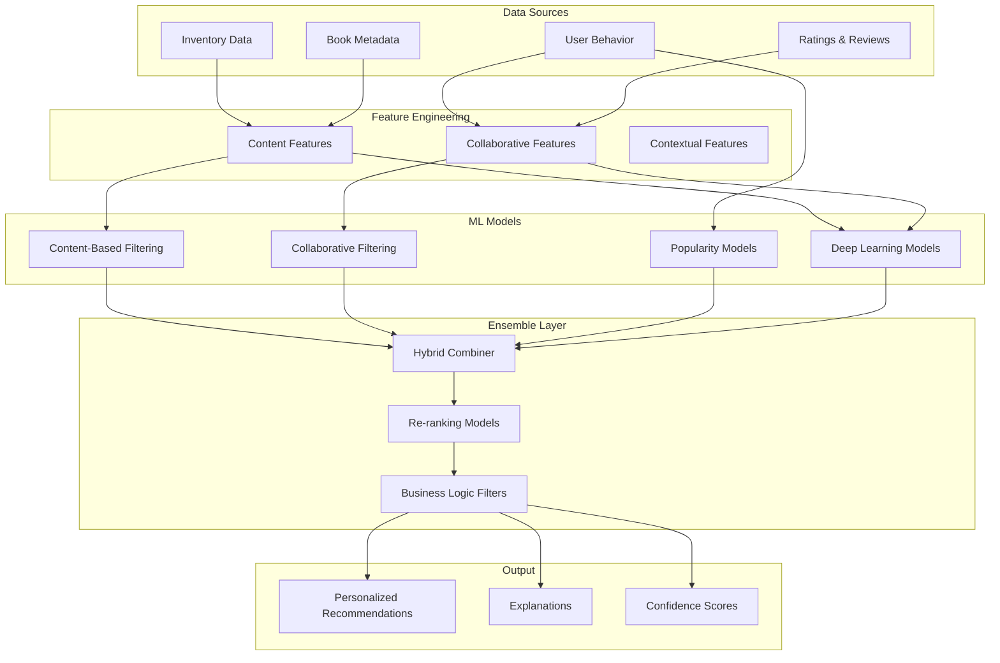

# BookVerse Recommendations Service - Machine Learning Guide

**Advanced ML Implementation for Personalized Book Recommendations**

This guide provides comprehensive documentation of the machine learning models, algorithms, and data science practices implemented in the BookVerse Recommendations Service.

---

## 🧠 ML Architecture Overview

The Recommendations Service implements a **Hybrid Recommendation System** that combines multiple machine learning approaches to deliver personalized, accurate, and diverse book recommendations:



---

## 🎯 Recommendation Algorithms

### Content-Based Filtering

#### **Algorithm Overview**
Content-based filtering recommends books based on their intrinsic features and similarity to books the user has previously interacted with.

#### **Feature Extraction**
```python
# Content feature engineering pipeline
class ContentFeatureExtractor:
    def __init__(self):
        self.tfidf_vectorizer = TfidfVectorizer(
            max_features=5000,
            stop_words='english',
            ngram_range=(1, 2)
        )
        self.genre_encoder = MultiLabelBinarizer()
        self.author_encoder = LabelEncoder()
    
    def extract_features(self, books: List[Book]) -> np.ndarray:
        # Text features from titles and descriptions
        text_features = self.tfidf_vectorizer.fit_transform(
            [f"{book.title} {book.description}" for book in books]
        )
        
        # Genre features (multi-hot encoding)
        genre_features = self.genre_encoder.fit_transform(
            [book.genres for book in books]
        )
        
        # Author features
        author_features = self.author_encoder.fit_transform(
            [book.primary_author for book in books]
        ).reshape(-1, 1)
        
        # Combine all features
        return hstack([text_features, genre_features, author_features])
```

#### **Similarity Computation**
- **Text Similarity**: Cosine similarity on TF-IDF vectors for titles and descriptions
- **Genre Similarity**: Jaccard similarity for multi-label genre classifications
- **Author Similarity**: Binary matching with author popularity weighting
- **Combined Score**: Weighted combination of individual similarity scores

#### **Configuration Parameters**
```yaml
content_based:
  text_weight: 0.5
  genre_weight: 0.3
  author_weight: 0.2
  min_similarity_threshold: 0.1
  max_recommendations: 50
  feature_dimensions: 5000
```

### Collaborative Filtering

#### **User-Based Collaborative Filtering**
Recommends books based on preferences of users with similar reading patterns.

```python
class UserBasedCF:
    def __init__(self, similarity_metric='cosine', k_neighbors=50):
        self.similarity_metric = similarity_metric
        self.k_neighbors = k_neighbors
        self.user_similarity_matrix = None
    
    def fit(self, user_item_matrix: sp.sparse_matrix):
        # Compute user-user similarity matrix
        if self.similarity_metric == 'cosine':
            self.user_similarity_matrix = cosine_similarity(user_item_matrix)
        elif self.similarity_metric == 'pearson':
            self.user_similarity_matrix = np.corrcoef(user_item_matrix.toarray())
    
    def predict(self, user_id: int, item_ids: List[int]) -> List[float]:
        # Find k most similar users
        similar_users = self.get_similar_users(user_id, self.k_neighbors)
        
        # Predict ratings based on similar users' preferences
        predictions = []
        for item_id in item_ids:
            prediction = self.predict_rating(user_id, item_id, similar_users)
            predictions.append(prediction)
        
        return predictions
```

#### **Item-Based Collaborative Filtering**
Recommends books similar to those the user has previously rated highly.

```python
class ItemBasedCF:
    def __init__(self, similarity_metric='cosine', k_neighbors=20):
        self.similarity_metric = similarity_metric
        self.k_neighbors = k_neighbors
        self.item_similarity_matrix = None
    
    def fit(self, user_item_matrix: sp.sparse_matrix):
        # Transpose to get item-item relationships
        item_user_matrix = user_item_matrix.T
        
        # Compute item-item similarity matrix
        self.item_similarity_matrix = cosine_similarity(item_user_matrix)
    
    def recommend(self, user_profile: Dict[int, float], n_recommendations: int = 10):
        # Find items similar to user's liked items
        candidate_items = set()
        for item_id, rating in user_profile.items():
            if rating >= 4.0:  # High rating threshold
                similar_items = self.get_similar_items(item_id, self.k_neighbors)
                candidate_items.update(similar_items)
        
        return self.rank_candidates(candidate_items, user_profile, n_recommendations)
```

#### **Matrix Factorization**
Advanced collaborative filtering using dimensionality reduction techniques.

```python
class MatrixFactorizationCF:
    def __init__(self, n_factors=100, learning_rate=0.01, regularization=0.02):
        self.n_factors = n_factors
        self.learning_rate = learning_rate
        self.regularization = regularization
        self.user_factors = None
        self.item_factors = None
    
    def fit(self, user_item_matrix: sp.sparse_matrix, n_epochs=100):
        n_users, n_items = user_item_matrix.shape
        
        # Initialize factor matrices
        self.user_factors = np.random.normal(0, 0.1, (n_users, self.n_factors))
        self.item_factors = np.random.normal(0, 0.1, (n_items, self.n_factors))
        
        # Stochastic Gradient Descent training
        for epoch in range(n_epochs):
            for user_id, item_id, rating in self.get_non_zero_entries(user_item_matrix):
                prediction = np.dot(self.user_factors[user_id], self.item_factors[item_id])
                error = rating - prediction
                
                # Update factors using gradient descent
                user_factor_update = error * self.item_factors[item_id] - \
                                   self.regularization * self.user_factors[user_id]
                item_factor_update = error * self.user_factors[user_id] - \
                                   self.regularization * self.item_factors[item_id]
                
                self.user_factors[user_id] += self.learning_rate * user_factor_update
                self.item_factors[item_id] += self.learning_rate * item_factor_update
```

### Deep Learning Models

#### **Neural Collaborative Filtering**
Deep learning approach that learns complex user-item interactions.

```python
import tensorflow as tf
from tensorflow.keras import layers, Model

class NeuralCollaborativeFiltering:
    def __init__(self, n_users, n_items, embedding_dim=64, hidden_units=[128, 64]):
        self.n_users = n_users
        self.n_items = n_items
        self.embedding_dim = embedding_dim
        self.hidden_units = hidden_units
        self.model = self.build_model()
    
    def build_model(self):
        # User and item embeddings
        user_input = layers.Input(shape=(), name='user_id')
        item_input = layers.Input(shape=(), name='item_id')
        
        user_embedding = layers.Embedding(
            self.n_users, self.embedding_dim, name='user_embedding'
        )(user_input)
        item_embedding = layers.Embedding(
            self.n_items, self.embedding_dim, name='item_embedding'
        )(item_embedding)
        
        # Flatten embeddings
        user_vec = layers.Flatten()(user_embedding)
        item_vec = layers.Flatten()(item_embedding)
        
        # Concatenate user and item embeddings
        concat = layers.Concatenate()([user_vec, item_vec])
        
        # Deep neural network layers
        x = concat
        for units in self.hidden_units:
            x = layers.Dense(units, activation='relu')(x)
            x = layers.Dropout(0.2)(x)
        
        # Output layer
        output = layers.Dense(1, activation='sigmoid', name='rating')(x)
        
        model = Model(inputs=[user_input, item_input], outputs=output)
        model.compile(
            optimizer='adam',
            loss='binary_crossentropy',
            metrics=['mae', 'mse']
        )
        
        return model
    
    def train(self, user_ids, item_ids, ratings, validation_split=0.2, epochs=50):
        history = self.model.fit(
            [user_ids, item_ids], ratings,
            validation_split=validation_split,
            epochs=epochs,
            batch_size=256,
            verbose=1
        )
        return history
```

### Popularity-Based Models

#### **Trending Books Algorithm**
Identifies books gaining popularity based on recent interactions and ratings.

```python
class TrendingBooksModel:
    def __init__(self, time_decay_factor=0.95, min_interactions=10):
        self.time_decay_factor = time_decay_factor
        self.min_interactions = min_interactions
    
    def calculate_trending_score(self, book_interactions: List[Interaction]) -> float:
        current_time = datetime.now()
        score = 0.0
        
        for interaction in book_interactions:
            # Time-decayed weight
            days_ago = (current_time - interaction.timestamp).days
            time_weight = self.time_decay_factor ** days_ago
            
            # Interaction type weight
            if interaction.type == 'purchase':
                type_weight = 1.0
            elif interaction.type == 'rating':
                type_weight = 0.8 * (interaction.rating / 5.0)
            elif interaction.type == 'view':
                type_weight = 0.3
            else:
                type_weight = 0.1
            
            score += time_weight * type_weight
        
        return score if len(book_interactions) >= self.min_interactions else 0.0
```

#### **Quality-Based Ranking**
Combines average rating, number of reviews, and recency for quality assessment.

```python
class QualityRankingModel:
    def __init__(self, rating_weight=0.6, review_count_weight=0.3, recency_weight=0.1):
        self.rating_weight = rating_weight
        self.review_count_weight = review_count_weight
        self.recency_weight = recency_weight
    
    def calculate_quality_score(self, book: Book) -> float:
        # Average rating component (0-1 scale)
        rating_score = (book.average_rating - 1) / 4  # Convert 1-5 to 0-1
        
        # Review count component (logarithmic scaling)
        review_score = min(1.0, np.log10(book.review_count + 1) / 3)  # Cap at 1000 reviews
        
        # Recency component
        days_since_publication = (datetime.now() - book.publication_date).days
        recency_score = max(0, 1 - (days_since_publication / 365))  # Decay over 1 year
        
        # Weighted combination
        quality_score = (
            self.rating_weight * rating_score +
            self.review_count_weight * review_score +
            self.recency_weight * recency_score
        )
        
        return quality_score
```

---

## 🔄 Hybrid Model Combination

### Ensemble Strategy

#### **Weighted Linear Combination**
Combines predictions from multiple models using learned or configured weights.

```python
class HybridRecommender:
    def __init__(self, models: Dict[str, BaseRecommender], weights: Dict[str, float]):
        self.models = models
        self.weights = weights
        self.ensemble_method = 'weighted_linear'
    
    def recommend(self, user_id: str, n_recommendations: int = 10) -> List[Recommendation]:
        # Get predictions from all models
        model_predictions = {}
        for model_name, model in self.models.items():
            predictions = model.recommend(user_id, n_recommendations * 3)  # Get more for diversity
            model_predictions[model_name] = predictions
        
        # Combine predictions using weighted average
        combined_scores = self.combine_predictions(model_predictions)
        
        # Rank and return top recommendations
        return self.rank_and_filter(combined_scores, n_recommendations)
    
    def combine_predictions(self, model_predictions: Dict[str, List[Prediction]]) -> Dict[str, float]:
        combined_scores = defaultdict(float)
        
        for model_name, predictions in model_predictions.items():
            weight = self.weights.get(model_name, 1.0)
            
            for prediction in predictions:
                combined_scores[prediction.item_id] += weight * prediction.score
        
        return combined_scores
```

#### **Meta-Learning Approach**
Uses a meta-model to learn optimal combination strategies from user feedback.

```python
class MetaLearningEnsemble:
    def __init__(self, base_models: List[BaseRecommender]):
        self.base_models = base_models
        self.meta_model = xgb.XGBRegressor(
            n_estimators=100,
            learning_rate=0.1,
            max_depth=6
        )
    
    def train_meta_model(self, training_data: List[UserInteraction]):
        # Generate features from base model predictions
        features, targets = self.prepare_meta_features(training_data)
        
        # Train meta-model to predict user satisfaction
        self.meta_model.fit(features, targets)
    
    def prepare_meta_features(self, interactions: List[UserInteraction]) -> Tuple[np.ndarray, np.ndarray]:
        features = []
        targets = []
        
        for interaction in interactions:
            # Get predictions from all base models
            base_predictions = []
            for model in self.base_models:
                prediction = model.predict(interaction.user_id, interaction.item_id)
                base_predictions.append(prediction)
            
            # Add contextual features
            context_features = [
                interaction.time_of_day,
                interaction.day_of_week,
                interaction.user_activity_level
            ]
            
            # Combine base predictions and context
            feature_vector = base_predictions + context_features
            features.append(feature_vector)
            
            # Target is user satisfaction (rating, purchase, etc.)
            targets.append(interaction.satisfaction_score)
        
        return np.array(features), np.array(targets)
```

### Re-ranking Models

#### **Diversity Re-ranking**
Ensures recommendation diversity while maintaining relevance.

```python
class DiversityReranker:
    def __init__(self, diversity_weight=0.3, similarity_threshold=0.8):
        self.diversity_weight = diversity_weight
        self.similarity_threshold = similarity_threshold
    
    def rerank(self, recommendations: List[Recommendation], user_profile: UserProfile) -> List[Recommendation]:
        reranked = []
        excluded_similar = set()
        
        # Sort by original relevance score
        sorted_recs = sorted(recommendations, key=lambda x: x.relevance_score, reverse=True)
        
        for rec in sorted_recs:
            if rec.item_id in excluded_similar:
                continue
            
            # Calculate diversity bonus
            diversity_score = self.calculate_diversity_score(rec, reranked, user_profile)
            
            # Combine relevance and diversity
            final_score = (
                (1 - self.diversity_weight) * rec.relevance_score +
                self.diversity_weight * diversity_score
            )
            
            rec.final_score = final_score
            reranked.append(rec)
            
            # Mark similar items for exclusion
            similar_items = self.find_similar_items(rec.item_id, sorted_recs)
            excluded_similar.update(similar_items)
        
        return sorted(reranked, key=lambda x: x.final_score, reverse=True)
    
    def calculate_diversity_score(self, candidate: Recommendation, 
                                selected: List[Recommendation], 
                                user_profile: UserProfile) -> float:
        if not selected:
            return 1.0
        
        # Calculate minimum dissimilarity to selected items
        min_dissimilarity = 1.0
        for selected_rec in selected:
            similarity = self.item_similarity(candidate.item_id, selected_rec.item_id)
            dissimilarity = 1 - similarity
            min_dissimilarity = min(min_dissimilarity, dissimilarity)
        
        return min_dissimilarity
```

---

## 📊 Feature Engineering

### User Features

#### **Behavioral Features**
```python
class UserBehaviorFeatures:
    def extract_features(self, user_interactions: List[Interaction]) -> Dict[str, float]:
        features = {}
        
        # Reading frequency
        features['avg_books_per_month'] = self.calculate_reading_frequency(user_interactions)
        
        # Genre preferences (entropy-based diversity)
        genre_distribution = self.get_genre_distribution(user_interactions)
        features['genre_diversity'] = self.calculate_entropy(genre_distribution)
        
        # Author loyalty
        features['author_repeat_rate'] = self.calculate_author_repeat_rate(user_interactions)
        
        # Price sensitivity
        features['avg_book_price'] = np.mean([i.book_price for i in user_interactions])
        features['price_variance'] = np.var([i.book_price for i in user_interactions])
        
        # Seasonal patterns
        seasonal_patterns = self.analyze_seasonal_patterns(user_interactions)
        features.update(seasonal_patterns)
        
        # Review behavior
        features['review_rate'] = len([i for i in user_interactions if i.review]) / len(user_interactions)
        features['avg_review_length'] = np.mean([len(i.review) for i in user_interactions if i.review])
        
        return features
```

#### **Demographic Features**
```python
class UserDemographicFeatures:
    def extract_features(self, user: User) -> Dict[str, float]:
        features = {}
        
        # Age-related features
        features['age'] = user.age
        features['age_group'] = self.categorize_age(user.age)
        
        # Geographic features
        features['country'] = self.encode_country(user.country)
        features['timezone'] = self.encode_timezone(user.timezone)
        
        # Account features
        account_age_days = (datetime.now() - user.registration_date).days
        features['account_age_days'] = account_age_days
        features['is_premium_user'] = float(user.is_premium)
        
        return features
```

### Item Features

#### **Content Features**
```python
class BookContentFeatures:
    def __init__(self):
        self.text_analyzer = TextAnalyzer()
        self.genre_encoder = MultiLabelBinarizer()
    
    def extract_features(self, book: Book) -> Dict[str, any]:
        features = {}
        
        # Text-based features
        title_features = self.text_analyzer.analyze(book.title)
        description_features = self.text_analyzer.analyze(book.description)
        
        features['title_sentiment'] = title_features['sentiment']
        features['title_complexity'] = title_features['complexity_score']
        features['description_length'] = len(book.description)
        features['description_readability'] = description_features['readability_score']
        
        # Metadata features
        features['page_count'] = book.page_count
        features['publication_year'] = book.publication_date.year
        features['is_series'] = float(book.series_info is not None)
        features['author_popularity'] = self.get_author_popularity(book.author)
        
        # Genre features
        features['genre_count'] = len(book.genres)
        features['primary_genre'] = book.genres[0] if book.genres else 'unknown'
        
        # Commercial features
        features['price'] = float(book.price)
        features['discount_percentage'] = book.discount_percentage
        features['is_bestseller'] = float(book.is_bestseller)
        
        return features
```

### Contextual Features

#### **Session Context**
```python
class SessionContextFeatures:
    def extract_features(self, session: UserSession) -> Dict[str, float]:
        features = {}
        
        # Temporal features
        features['hour_of_day'] = session.timestamp.hour
        features['day_of_week'] = session.timestamp.weekday()
        features['is_weekend'] = float(session.timestamp.weekday() >= 5)
        
        # Device and platform
        features['device_type'] = self.encode_device(session.device_type)
        features['is_mobile'] = float(session.device_type == 'mobile')
        
        # Session behavior
        features['session_duration'] = session.duration_minutes
        features['pages_viewed'] = session.pages_viewed
        features['search_queries'] = len(session.search_queries)
        
        # Referral context
        features['referral_source'] = self.encode_referral(session.referral_source)
        features['is_organic_traffic'] = float(session.referral_source == 'organic')
        
        return features
```

---

## 🎯 Model Evaluation

### Offline Evaluation Metrics

#### **Accuracy Metrics**
```python
class RecommenderEvaluator:
    def __init__(self):
        self.metrics = {
            'precision_at_k': self.precision_at_k,
            'recall_at_k': self.recall_at_k,
            'ndcg_at_k': self.ndcg_at_k,
            'map_at_k': self.map_at_k
        }
    
    def precision_at_k(self, recommendations: List[str], 
                      ground_truth: List[str], k: int = 10) -> float:
        """Calculate precision@k for recommendation list."""
        top_k_recs = recommendations[:k]
        relevant_recs = set(top_k_recs) & set(ground_truth)
        return len(relevant_recs) / min(k, len(top_k_recs))
    
    def recall_at_k(self, recommendations: List[str], 
                   ground_truth: List[str], k: int = 10) -> float:
        """Calculate recall@k for recommendation list."""
        top_k_recs = recommendations[:k]
        relevant_recs = set(top_k_recs) & set(ground_truth)
        return len(relevant_recs) / len(ground_truth) if ground_truth else 0.0
    
    def ndcg_at_k(self, recommendations: List[str], 
                 ground_truth_scores: Dict[str, float], k: int = 10) -> float:
        """Calculate Normalized Discounted Cumulative Gain@k."""
        top_k_recs = recommendations[:k]
        
        # Calculate DCG
        dcg = 0.0
        for i, item_id in enumerate(top_k_recs):
            relevance = ground_truth_scores.get(item_id, 0.0)
            dcg += relevance / np.log2(i + 2)  # i+2 because log2(1) = 0
        
        # Calculate IDCG (ideal DCG)
        ideal_order = sorted(ground_truth_scores.values(), reverse=True)[:k]
        idcg = sum(rel / np.log2(i + 2) for i, rel in enumerate(ideal_order))
        
        return dcg / idcg if idcg > 0 else 0.0
```

#### **Diversity Metrics**
```python
class DiversityEvaluator:
    def __init__(self, item_features: Dict[str, np.ndarray]):
        self.item_features = item_features
    
    def intra_list_diversity(self, recommendations: List[str]) -> float:
        """Calculate average pairwise dissimilarity within recommendation list."""
        if len(recommendations) < 2:
            return 0.0
        
        total_dissimilarity = 0.0
        pair_count = 0
        
        for i in range(len(recommendations)):
            for j in range(i + 1, len(recommendations)):
                item1_features = self.item_features[recommendations[i]]
                item2_features = self.item_features[recommendations[j]]
                
                similarity = cosine_similarity([item1_features], [item2_features])[0][0]
                dissimilarity = 1 - similarity
                
                total_dissimilarity += dissimilarity
                pair_count += 1
        
        return total_dissimilarity / pair_count
    
    def coverage(self, all_recommendations: List[List[str]], 
                catalog_items: List[str]) -> float:
        """Calculate catalog coverage across all users."""
        recommended_items = set()
        for user_recs in all_recommendations:
            recommended_items.update(user_recs)
        
        return len(recommended_items) / len(catalog_items)
```

### Online Evaluation (A/B Testing)

#### **Experiment Framework**
```python
class ABTestFramework:
    def __init__(self, experiment_config: Dict):
        self.config = experiment_config
        self.user_assignments = {}
        self.metrics_collector = MetricsCollector()
    
    def assign_user_to_variant(self, user_id: str) -> str:
        """Assign user to A/B test variant based on consistent hashing."""
        if user_id in self.user_assignments:
            return self.user_assignments[user_id]
        
        # Use consistent hashing for stable assignment
        hash_value = hashlib.md5(user_id.encode()).hexdigest()
        hash_int = int(hash_value, 16)
        
        # Determine variant based on traffic split
        variant_threshold = self.config['traffic_split']['variant_a']
        if (hash_int % 100) < variant_threshold:
            variant = 'variant_a'
        else:
            variant = 'variant_b'
        
        self.user_assignments[user_id] = variant
        return variant
    
    def track_interaction(self, user_id: str, interaction: Interaction):
        """Track user interaction for A/B test analysis."""
        variant = self.assign_user_to_variant(user_id)
        
        self.metrics_collector.record_interaction(
            user_id=user_id,
            variant=variant,
            interaction=interaction,
            timestamp=datetime.now()
        )
    
    def analyze_results(self) -> Dict[str, any]:
        """Statistical analysis of A/B test results."""
        variant_a_data = self.metrics_collector.get_variant_data('variant_a')
        variant_b_data = self.metrics_collector.get_variant_data('variant_b')
        
        results = {}
        
        # Click-through rate analysis
        ctr_a = self.calculate_ctr(variant_a_data)
        ctr_b = self.calculate_ctr(variant_b_data)
        
        # Statistical significance test
        significance_test = self.chi_square_test(variant_a_data, variant_b_data)
        
        results['ctr_variant_a'] = ctr_a
        results['ctr_variant_b'] = ctr_b
        results['ctr_lift'] = (ctr_b - ctr_a) / ctr_a if ctr_a > 0 else 0
        results['statistical_significance'] = significance_test
        
        return results
```

---

## 🚀 Model Training Pipeline

### Training Infrastructure

#### **Distributed Training**
```python
class DistributedTrainingPipeline:
    def __init__(self, model_config: Dict, cluster_config: Dict):
        self.model_config = model_config
        self.cluster_config = cluster_config
        self.data_loader = DataLoader()
        self.model_registry = ModelRegistry()
    
    def run_training_pipeline(self, training_date: datetime):
        """Execute complete model training pipeline."""
        
        # Step 1: Data preparation
        training_data = self.data_loader.load_training_data(training_date)
        validation_data = self.data_loader.load_validation_data(training_date)
        
        # Step 2: Feature engineering
        feature_pipeline = FeaturePipeline(self.model_config['features'])
        X_train, y_train = feature_pipeline.transform(training_data)
        X_val, y_val = feature_pipeline.transform(validation_data)
        
        # Step 3: Model training
        models = {}
        for model_name, model_config in self.model_config['models'].items():
            model = self.train_model(model_name, model_config, X_train, y_train)
            models[model_name] = model
        
        # Step 4: Model evaluation
        evaluation_results = self.evaluate_models(models, X_val, y_val)
        
        # Step 5: Model selection and registration
        best_model = self.select_best_model(models, evaluation_results)
        self.model_registry.register_model(best_model, evaluation_results)
        
        return best_model, evaluation_results
    
    def train_model(self, model_name: str, config: Dict, X_train, y_train):
        """Train individual model with distributed computing."""
        
        if model_name == 'collaborative_filtering':
            model = MatrixFactorizationCF(**config['hyperparameters'])
        elif model_name == 'content_based':
            model = ContentBasedRecommender(**config['hyperparameters'])
        elif model_name == 'neural_cf':
            model = NeuralCollaborativeFiltering(**config['hyperparameters'])
        else:
            raise ValueError(f"Unknown model type: {model_name}")
        
        # Train model with early stopping and checkpointing
        model.fit(
            X_train, y_train,
            validation_data=(X_val, y_val),
            early_stopping_patience=config.get('early_stopping_patience', 10),
            checkpoint_dir=config.get('checkpoint_dir', '/tmp/model_checkpoints')
        )
        
        return model
```

#### **Hyperparameter Optimization**
```python
class HyperparameterOptimizer:
    def __init__(self, search_space: Dict, optimization_metric: str = 'ndcg_at_10'):
        self.search_space = search_space
        self.optimization_metric = optimization_metric
        self.study = optuna.create_study(direction='maximize')
    
    def objective(self, trial):
        """Optuna objective function for hyperparameter optimization."""
        
        # Sample hyperparameters
        hyperparams = {}
        for param_name, param_config in self.search_space.items():
            if param_config['type'] == 'float':
                hyperparams[param_name] = trial.suggest_float(
                    param_name, param_config['low'], param_config['high']
                )
            elif param_config['type'] == 'int':
                hyperparams[param_name] = trial.suggest_int(
                    param_name, param_config['low'], param_config['high']
                )
            elif param_config['type'] == 'categorical':
                hyperparams[param_name] = trial.suggest_categorical(
                    param_name, param_config['choices']
                )
        
        # Train model with sampled hyperparameters
        model = self.create_model(hyperparams)
        model.fit(self.X_train, self.y_train)
        
        # Evaluate model performance
        predictions = model.predict(self.X_val)
        metric_value = self.calculate_metric(predictions, self.y_val)
        
        return metric_value
    
    def optimize(self, n_trials: int = 100):
        """Run hyperparameter optimization."""
        self.study.optimize(self.objective, n_trials=n_trials)
        
        return {
            'best_params': self.study.best_params,
            'best_value': self.study.best_value,
            'trials_summary': self.study.trials_dataframe()
        }
```

### Model Deployment

#### **Model Versioning and Registry**
```python
class ModelRegistry:
    def __init__(self, storage_backend: str = 's3'):
        self.storage_backend = storage_backend
        self.metadata_store = ModelMetadataStore()
    
    def register_model(self, model: BaseRecommender, 
                      evaluation_results: Dict, 
                      model_name: str = None) -> str:
        """Register trained model with versioning."""
        
        # Generate model version
        model_version = self.generate_version(model_name)
        
        # Serialize model
        model_path = f"models/{model_name}/{model_version}"
        self.save_model(model, model_path)
        
        # Store metadata
        metadata = {
            'model_name': model_name,
            'model_version': model_version,
            'training_date': datetime.now().isoformat(),
            'evaluation_results': evaluation_results,
            'hyperparameters': model.get_params(),
            'model_path': model_path,
            'status': 'registered'
        }
        
        self.metadata_store.save_metadata(model_version, metadata)
        
        return model_version
    
    def load_model(self, model_name: str, version: str = 'latest') -> BaseRecommender:
        """Load model from registry."""
        
        if version == 'latest':
            version = self.get_latest_version(model_name)
        
        metadata = self.metadata_store.load_metadata(version)
        model_path = metadata['model_path']
        
        return self.load_model_from_path(model_path)
    
    def promote_model(self, model_version: str, environment: str):
        """Promote model to specific environment (staging/production)."""
        
        metadata = self.metadata_store.load_metadata(model_version)
        
        # Update metadata with promotion info
        metadata['environments'] = metadata.get('environments', {})
        metadata['environments'][environment] = {
            'promoted_at': datetime.now().isoformat(),
            'promoted_by': self.get_current_user()
        }
        
        self.metadata_store.save_metadata(model_version, metadata)
        
        # Update environment-specific model pointer
        self.update_environment_model(environment, model_version)
```

---

## 🔗 Related Documentation

- **[Algorithm Guide](ALGORITHM_GUIDE.md)**: High-level overview of recommendation algorithms
- **[Architecture Guide](ARCHITECTURE.md)**: System architecture and API/Worker separation
- **[Operations Guide](OPERATIONS.md)**: Monitoring, troubleshooting, and maintenance
- **[Development Guide](DEVELOPMENT_GUIDE.md)**: Local development and testing setup
- **[API Reference](../api/README.md)**: Complete API documentation and examples

---

**Authors**: BookVerse Platform Team  
**Version**: 1.0.0  
**Last Updated**: 2024-01-01
